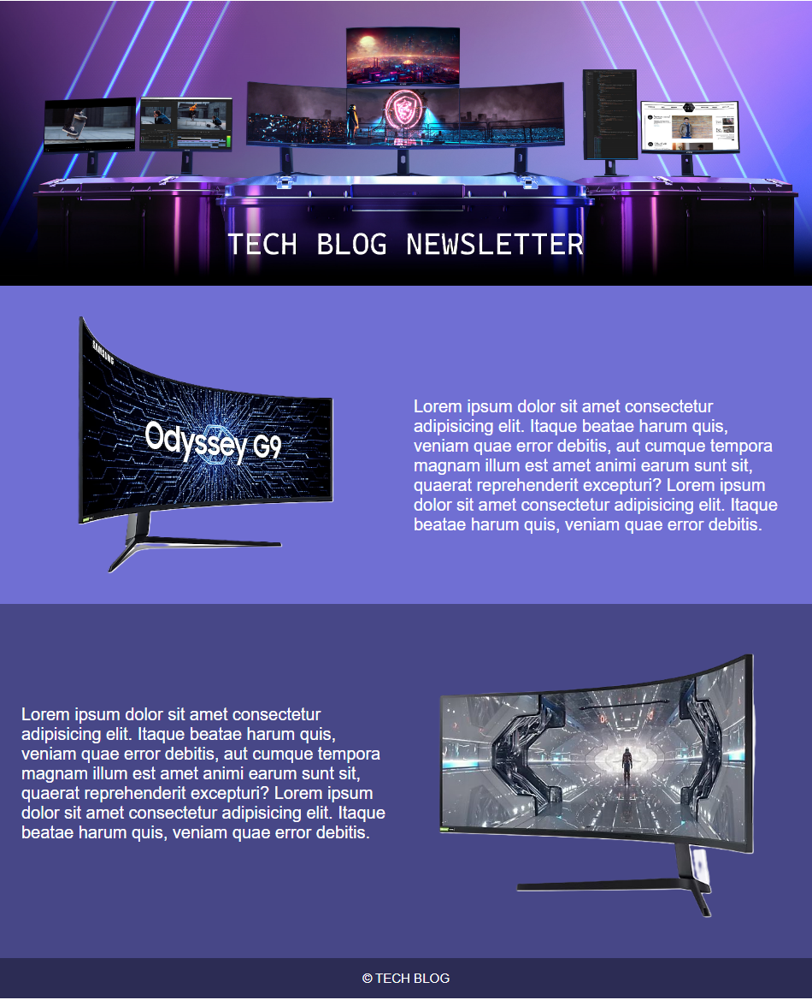

# Email for a Blog


This application is an e-mail for a tech blog, built using only HTML and inline styling.

## Index
- <a href="#tecnologies-used">Tecnologies used</a>
- <a href="#developer">Developer</a>

## How to run the application
```bash
# Clone this repository
$ git clone repolink

# Acess the app folder on your terminal
$ cd blog-email


# Utilize a local server launch tool to view the application in your browser

```

## Tecnologies used
1. HTML

## Developer
[LinkedIn](https://www.linkedin.com/in/julia-silva-borges/)
